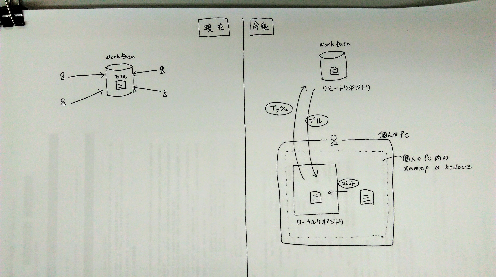

# gitでの開発環境

## メリット
- html、css、jsファイル等のバージョン管理  
誰がいつ、どのような修正をしたか履歴を残せる。
- 画像のバージョン比較も可能 [参照url](https://www.cherrypieweb.com/weblog/technical/20130331014928.php)  
- dream weaver CC もgitに対応[参照url](https://blogs.adobe.com/creativestation/web-dreamweaver-cc-git-support)
- 最近のエディターソフト（visual studio code等）も最初からgit対応している

## デメリット
- ひと手間増える  
これまでは、workdata内のファイルを直接編集していた。今後はgitを使用して個人pcにclone（クローン）して編集することになる。
- 「競合」とか「ブランチ」になると、gitの理解が難しい。
- NICのsvnと同じようなもの（ちょっと違うけど）

## 結論
- ソフトがgitに対応してきている事を考えると、git化はさけられないのでは？
- 最初は「競合」とか「ブランチ」は難しいので、気にせず、ただのファイル共有として使ってみる  
（現在のworkdataと何も変わらない使い方、オペレーションが少し変わるだけ）
- 少し触ってみて感じたのは、**実際に使ってみないと、全く、まったく、全然、理解できない**

 
 

# 開発環境の変更

## （仮）変更イメージ

## 現在の開発環境
- workdataのファイルを各個人が直接修正
- 同時に開かないように注意しながら作業
- 誰が修正したのかは、ディレクター or 修正した本人しか、わからない。

## 今後の開発環境  
- workdataから各個人PCにコピー（git clone）したファイルを修正
- 各個人pc内のwebサーバーで修正・確認することになる。
- ディレクターは、変わらずworkdataで確認。
- 誰がいつどんな作業をしたのか、全員がわかるようになる。

## 個人PCで作業するにあたっての問題点。
- 各個人PCで作業するには、webサーバーが必要。
- gulp のwebサーバーでは駄目なのか？  
gulp でもgulp-connect-php とかでweb serverを立てれる。  
でも、いちいち作業フォルダ内のgulpを起動するのか？
- xampp と gulp どっちでもいいけど、簡単なのはxamppかなぁ。  
xampp の方が、windowsの起動と同時に起動するようにしちゃえば楽。
- **ただ、xamppを使用する場合、注意しないといけない事もある [こちらを参照](#anc-xampp)**

 
 

# とにかく実際に触ってみよう。  
（触らないと、絶対わからない）  
 
## 1. git インストール
- [参照url](https://qiita.com/toshi-click/items/dcf3dd48fdc74c91b409)

## 2. gitクライアント インストール
- Source Tree（一番メジャーかな？？）  
[参照url](https://eng-entrance.com/sourcetree-use)  
思ったより簡単なソフト。機能もよくみると、そんなに多くなさそう。シンプル。単純に使うなら、左上の大きいボタンだけでOK。  
[インストール方法 参照url](https://eng-entrance.com/sourcetree)  
※インストールの途中でAtlassianのアカウント登録をしないとインストールが進まない箇所がありますので登録してください。  
   
- Tortoise Git（tortoise SVNと同じ）  
[参照url](https://backlog.com/ja/git-tutorial/intro/intro2_1.html)  
なんとなくNIC案件でbad feelだったので、やめとく。

クライアントツールは、いろいろあるけどsource tree が参考サイトが多いので、とりあえずはこのソフトで慣れよう。  
実際にはコマンドの操作をGUI化しているだけで、慣れてくると「コマンドの方が早いわ」ってなる可能性はある。

## 3. リモートリポジトリを作成
- 本来はworkdataをリモートリポジトリにする。(予定)  
- 現在は、まだworkdataを準備中なので、git hub をリモートリポジトリとしてgitを使ってみる。  
ただ、無料だとpublic（一般公開）なので、**実際の仕事のデータ（クライアントのhtml等）はアップしない。**
- git hubへ接続するには公開鍵が必要です（[下記参照](#anc-github)）
- backlogでもリモートリポジトリ作れる。

## 4. gitの簡単な操作を体験してみる  
どうでもいいファイル・リポジトリで、とにかく試す。  
まずは簡単な操作だけ。  
下記をやってみると、gitへの恐怖心が少し減る。  

1. リモートリポジトリからクローン
2. ファイルを適当に編集
3. ローカルリポジトリへコミット
4. リモートリポジトリへプッシュ
5. リモートリポジトリからプル

[参照url](https://eng-entrance.com/sourcetree-use)

**マージ・ブランチは後回し。まずは単純な操作に慣れる。**

 
 

### 
git hub への接続方法

git hubへ接続するには、公開鍵が必要になる。  

1. git hub に自分のアカウントを作成
2. 秘密鍵、公開鍵を作成
[参照url](https://qiita.com/reflet/items/5c6ba6e29fe8436c3185)
3. 公開鍵をgithubに設定
[参照url](https://qiita.com/ajitama/items/364d89b21daf8d3481bc)
4. 秘密鍵をsourcetreeに設定
[参照url](https://qiita.com/reflet/items/4f7b5c4a312bc27df10e)
5. アクセス可能

※毎日パソコンを起動するたびに1回、秘密鍵のパスワードを入力しないといけないけど、まぁたいした作業じゃないし、セキュリティ的にはいいかも。

 

---

### テスト用に作成してみたリモートリポジトリ（参考）
- テスト用github（宮崎用）
https://github.com/miyazaki-mba/git_test
- テスト用backlog（宮崎用）
https://test-kaku.backlog.com/git/TEST

みなさん自分のアカウントを作成して、リモートリポジトリを作成してください。

 

### gitをworkdataで使えるように準備中
1. workdataに、git をインストールしてもらえるように、Mr.Nakamuraに依頼。  
一旦、Mr.Nakamuraにgitについて理解してもらってから、  
workdataのサーバーにインストールしてもらうことになった。

 

### gitについて参考URL
いろいろ書かれているけど、操作してみないと、全くわからない。
- [参照url](https://www.slideshare.net/matsukaz/git-28304397)  
- [参照url](https://backlog.com/ja/git-tutorial/intro/intro1_1.html) 

- [参照url](https://www.symmetric.co.jp/blog/archives/577)  
- [参照url](https://eng-entrance.com/category/programming/git)  

 

## 
個人PCでxamppを使用するにあたって

1. xampp インストール方法
[参照url](https://techacademy.jp/magazine/1722)
2. xampp セキュリティ設定
[参照url](https://techacademy.jp/magazine/2941)  

### xampp 懸念事項
- xamppで心配なのは、**サーバーの設定**の共有方法
- 各個人PCのサーバーの設定が同じじゃないと、制作上おかしいことになる。  
「この人は表示されるけど、この人は表示できない等」
- windows シンボリックリンクで、xamppのapacheの設定ファイルを、workdataのwebサーバーの設定ファイルを読みに行くようにしたらどうか？  
それっぽい記事があった。
