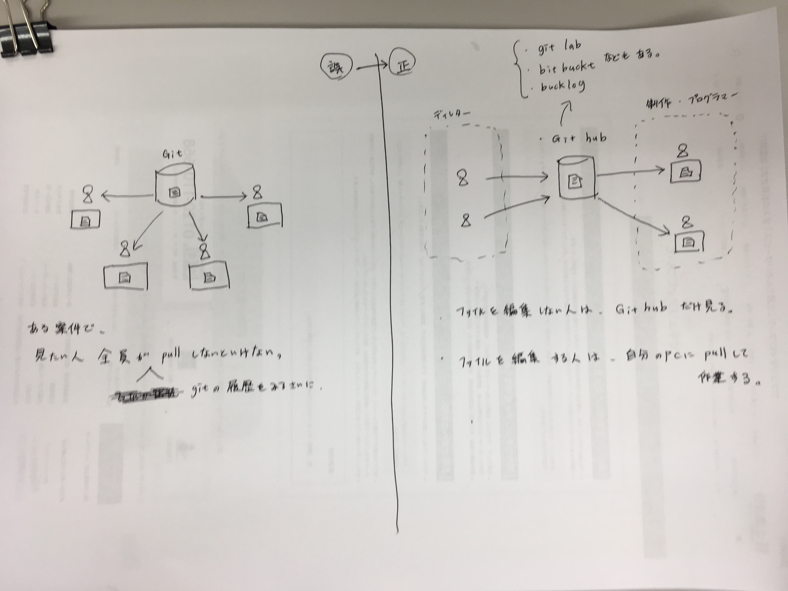

# Git hub の説明（gitではなく、git hubの方）
### Git hub 画面の説明
1. 画面上部  
[参照url](http://www.atmarkit.co.jp/ait/articles/1701/05/news009.html)

- 「Watch」はTwitterの「フォロー」  
フォローしたいリポジトリを「watch」をセレクトして「watching」にすると、ヘッダーの「ベルのマーク」の通知機能で、更新情報の通知を受け取れる。  
是非、Git hubに会員登録して、このgit hubのリポジトリに対して「watching」にしてみてください。  
- 「Star」はFacebookの「いいね！」  
[参照url](https://efcl.info/2014/07/30/find-github-release/)

- Marketplace は、リポジトリを販売している場所  
[参照url](https://japan.cnet.com/article/35101578/)

- explore は、イケイケなリポジトリを紹介している場所  
[参照url](https://qiita.com/luckypool/items/21eb5f515358ee33529c)

---

1. issue （イシュー）は、問題点  
[参照url](https://seleck.cc/647)

2. Fork と pull Request （フォークとプルリクエスト）  
「fork」 他の人のリポジトリを自分のリポジトリにコピー。  
「pull Request」 それを作者にpullしてもらうように通知する。  
[参照url](http://kik.xii.jp/archives/179)  
[参照url](https://qiita.com/YumaInaura/items/acff806290c8953d3185)

3. projeccts リポジトリを管理。issueやノートを使用する。   
inVision にもあった、**プロジェクト機能**。  
例えば、1つの修正が、今どの状態なのか（制作中・テスト中・アップ済み）などカラムを移動させていく感じ。  
[参照url](https://qiita.com/nafu/items/8996738177c601dd81f9)
- zenhub  
[参照url](https://qiita.com/GeckoTang/items/f75b9a1c20c8e5091147)

4. wiki は、取扱い説明などを記載するっぽい？

5. insights はclone数や、issueの進行状況などの統計データ

 
 

# git hub を導入した開発環境
以前、[gitを導入した開発環境イメージ](https://github.com/miyazaki-mba/git_test/blob/master/about_git.md#anc_git_img)を記載しました。  
ですが、以前の開発環境イメージだと、gitの履歴を見る場合に、作業しない人（ディレクター・プロデューサー）もpullして自分のpcで確認する必要があります。  
※サイトを閲覧するだけなら、workdataのドメインで見れますが、gitの履歴を見るには、gitでpullしないと見れない。  
 
何か足りないなぁと思ってました。  
で、よくよく調べると、**git hubを業務で使用**してました。  
（もちろん金払って、プライベート領域で。）  
（git hub以外にも、似たようなツールが存在する。git lab、bitbucket、backlogなど）  
 
**gitホスティングサービス**と言っているみたいです。  
[参照url](https://qiita.com/k-yamada-github/items/07253054dc852a77d693)  
 
 
なので正しい開発環境は下記の右側です。  
## 開発環境（git hub使用）  
左は中途半端だった。右が正解。  

## git hub 導入している会社が増えている
- git hubが便利なので、業務で使う会社が増えている  
（大企業が軒並み利用している。microsoftがちょっと前にgithub買収した。）
- 上記のgit hubの機能で説明したとおり、プロジェクト管理が可能。
- 企業で利用する場合は、1ユーザー約1,000円/月～(10ユーザー 1年 120,000円)

- 「Team」プランから契約可能  
- もし、ソースファイルを社内に置きたいなら「Enterprise」プラン  
1ユーザー約2,327円/月～  （10ユーザー 1年279,240円）  
[参照url](https://github.co.jp/pricing.html)  
[参照url](http://careerhack.en-japan.com/report/detail/863)

## git hub 以外のgitホスティングサービス
- git lab  
[参照url](https://bitbucket.org/product/pricing?tab=cloud)  
社内サーバーにインストール可能。（でも日々メンテナンスしないといけない。更新頻度が高いとのこと）  
社内サーバーではなく、git labのサーバーを使うプランもある。  
slack連携可。  
無料。

- bitbucket  
[参照url](https://bitbucket.org/product/pricing?tab=cloud)  
5アカウント以上契約する場合、standardプランで、222円。（10ユーザー 1年 26,640円） 

- backlog（ミツエさん使用）  
[参照url](https://backlog.com/ja/)  
ユーザー無制限 16,800円/月（1年 168,000円）  
それ以下のプランは、要領・プロジェクト数に制限あり。  

- 比較しているサイト  
[参照url](https://qiita.com/k-yamada-github/items/07253054dc852a77d693)  
[参照url](http://tracpath.com/works/development/git-hosting-service/)  

 

**価格的には、git labか？ bitbucketか？** 

### git lab
- git lab
[参照url](https://about.gitlab.com/)
- git lab 非公式日本語サイト
[参照url](https://www.gitlab.jp/)
- git lab 注意点とノウハウ（2018/06版）  
Community Edition（CE）（gitlab-ce）は無料・無制限  
[参照url](https://techracho.bpsinc.jp/morimorihoge/2018_06_04/57628)   
- git lab CE（社内サーバー）インストール方法  
[参照url](https://www.creationline.com/lab/18684)  
[参照url](https://www.gitlab.jp/installation/)  

 

- 社内サーバーにインストールする場合、Community Edition（CE）（gitlab-ce）プラン。  
- パッケージをインストールするだけ。
- 頻繁に更新されるので、なるべく変なカスタマイズはしない方がいい。
- ただ、特定の人に管理者になってもらう運用だと、その人がいなくなった場合にストップするというリスクもある。
- ある程度、日本語対応している
- 宮崎作成リポジトリ  
- git labの使用方法については下記に記載しました。  
[参照url](https://gitlab.com/miyazaki-mba/test-first-project)  

 

### bit bucket  
- sourcetree を提供している会社
- 主要な部分は日本語対応している
- 宮崎作成リポジトリ
[参照url](https://bitbucket.org/miyazaki-mba/git-test-bitbucket/src/master/)  

 

**どちらがいいのか、これから、両方試してみたいと思います。**

 

# 結論  
外注との間でも使用していくのであれば、社内サーバーに置く（git lab社内版）のではなく、  
上記のような **gitホスティングサービス（外部サーバー）** を利用すべきかと思いってます。  
（クライアントが、絶対に社内にコンテンツファイルを置いてほしい！というのでなければ、）  
~~（というか、よくよく考えると、テストサーバーにアップしてる時点で、レンタルサーバーにアップしてるので。。。）  
（ミツエさんもbacklogのホスティングサーバーに置いていると思われる。）~~  
 
**gitホスティングサーバーが信用できない**という意見がありますので、一旦は社内サーバーにgit labをインストールする方法を選択したいと思います。  
外注との間では使用しない。社内のみ。  
（セキュリティを考慮して社内サーバーを使用するのであれば、外注とgitを使用する場合、別途　契約したgitホスティングサービスを利用すべき。社内ネットワークに外部からの穴はあけないほうがいいと思う。）

 

## これらのツールを使用してみて、ようやく知るかもしれない、最近の開発環境

- DevOps（デブオプス）  
[参照url](https://qiita.com/bremen/items/44c3de10413f45f9f41e)  
アプリ開発にあたる部分もあるかもしれないけど、どっちみちhtml修正だけでは、将来的に飯は食べていけなくなる気がするので、今の業務で活用できる部分は、やっていった方がいいのかなぁ。。。
